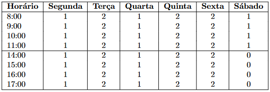
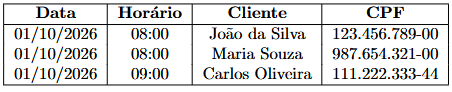

# PetShop
[webRef](https://fabiodelarocha.dec-services.ufsc.br/ensino/?file=2026.2.Programa%C3%A7%C3%A3o_WEB/Trabalhos/Trabalho_T1.pdf)<br>
[locRef](docs/Trabalho_T1.pdf) <sub> Accessed 19/09/26 </sub>


appointment capacity is represented by a number (int 0-inf)
<br>

<sub> Here zero shows there are no free time slots for that hour, Nonzero positive values display how many appointments are available at that hour</sub>

<h3> Client </h3> <br>
can: <br>
 - check available appointment times <br>
 - schedule an appointment at an available time by providing their name and CPF

<h3> Admin </h3> <br>
can: <br>
see appointments through <b>/listPetAgenda</b> listing (Date, time, clientName, CPF) <br>

 <br>
<sub>example  table</sub>

 - Edit available time slots through <b>/ajustaPetAgenda</b> setting how many slots are available for each day/hour

<h3> Database</h3>
persistent storage for Client, appointment and available time slot data objects.

<h3>Server & API</h3>
must be able to:
<ul>
<li>check available appointments</li>
<li>add or view clients</li>
<li>add appointment</li>
<li>get appointments</li>
<li>get and edit available time slots</li>
<li>get schedule</li>
</ul>

<h2> MINIMUM REQUIREMENTS </h2>
<ol>
<li>Webserver using Node.Js</li>
<li>Usage of the Express framework</li>
<li>Data Storage in MongoDb</li>
<li>Web Pages rendered using Handlebars</li>
<li>Ability to configure available time slots</li>
<li>View Available time slots</li>
</ol>


Installed packages
```
- Express
- Handlebars
```