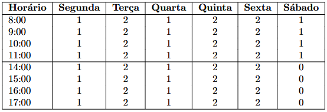
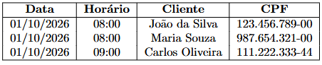

# PetShop
[webRef](https://fabiodelarocha.dec-services.ufsc.br/ensino/?file=2026.2.Programa%C3%A7%C3%A3o_WEB/Trabalhos/Trabalho_T1.pdf)<br>
[locRef](docs/Trabalho_T1.pdf) <sub> Accessed 19/09/26 </sub>


appointment capacity is represented by a number (int 0-inf)
<br>

<sub> Here zero shows there are no free time slots for that hour, Nonzero positive values display how many appointments are available at that hour</sub>


<h2> users, systems and their tasks:</h2>
<h3> Client </h3>
can:
<ul>
<li>check available appointment times </li> 
<li>schedule an appointment at an available time by providing their name and CPF</li> 
</ul>

<h3> Admin </h3>
can:
<ul>
<li>see appointments through <b>/listaPetAgenda</b> listing (Date, time, clientName, CPF)</li> 


<sub>example  table</sub>
<li> Edit available time slots through <b>/ajustaPetAgenda</b> setting how many slots are available for each day/hour</li>

</ul>


<h3> Database</h3>
persistent storage for Client, appointment and available time slot data objects.


<h3>Server & API</h3>
must be able to:
<ul>
<li>check available appointments</li>
<li>add or view clients</li>
<li>add appointment</li>
<li>get appointments</li>
<li>get and edit available time slots</li>
<li>get schedule</li>
</ul>

<h2> MINIMUM REQUIREMENTS </h2>
<ol>
<li>Webserver using Node.Js</li>
<li>Usage of the Express framework</li>
<li>Data Storage in MongoDb</li>
<li>Web Pages rendered using Handlebars</li>
<li>Ability to configure available time slots</li>
<li>View Available time slots</li>
</ol>

<h2> PROJECT STRUCTURE (MVC) </h2>

```
app/
├── controller/   # Request handlers for client and admin routes
├── model/        # MongoDB connection, data models, and business logic
├── view/         # Handlebars templates, layouts, and static CSS assets
└── app.mjs       # Express application entry point</code></pre>
```

<h2> HOW TO RUN </h2>

<h3> Option 1: Using Docker Compose (Recommended) </h3>

```
docker compose up --build</code></pre>
```

<h3> Option 2: Local Development (Node.js + Docker MongoDB) </h3>
1. Start MongoDB container

```
docker compose up -d db
```
<h3></h3>
2. Install dependencies and start development server

```
npm ci
npm run dev</code></pre>
```

<h3> Available Routes </h3>
<ul>
<li><b>Client Home &amp; Booking:</b> <code>http://localhost:3000/</code></li>
<li><b>Admin Appointment List:</b> <code>http://localhost:3000/listaPetAgenda</code></li>
<li><b>Admin Schedule Configuration:</b> <code>http://localhost:3000/ajustaPetAgenda</code></li>
</ul>

<h3> Installed packages </h3>

```
- Express
- Express-Handlebars / Handlebars
- Handlebars
```